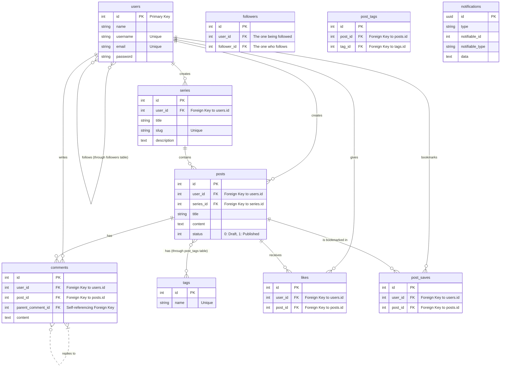

# Database Design for DevShare Lite

## 1. Design Overview
The database for DevShare Lite is a relational model designed to efficiently store and manage users, posts, and their interactions. It uses a set of interconnected tables to handle core functionalities like content creation, social interactions (likes, follows, comments), and content organization (tags, series).

The schema is normalized to reduce data redundancy. For example, many-to-many relationships, such as those between posts and tags, or users and followers, are managed through dedicated pivot tables.

## 2. Entity-Relationship Diagram (ERD)

The following diagram illustrates the relationships between the main entities in the database. It is generated using Mermaid syntax.

## 3. Table Schemas

This section provides a detailed explanation of each table, its columns, and their purpose.

### `users`

Stores user account information.

| Column | Data Type | Constraints | Description |
| :--- | :--- | :--- | :--- |
| **id** | `bigint` | **PK**, Unsigned, Auto-Increment | Unique identifier for each user. |
| name | `varchar(255)` | Not Null | The full name of the user. |
| username | `varchar(255)` | Not Null, **Unique** | The unique username for the user's profile URL. |
| email | `varchar(255)` | Not Null, **Unique** | The user's email address for login and notifications. |
| password | `varchar(255)` | Not Null | The user's hashed password. |
| `created_at`, `updated_at` | `timestamp` | Nullable | Timestamps for record creation and updates. |

---

### `posts`

Stores the content of each article.

| Column | Data Type | Constraints | Description |
| :--- | :--- | :--- | :--- |
| **id** | `bigint` | **PK**, Unsigned, Auto-Increment | Unique identifier for each post. |
| **user_id** | `bigint` | **FK** to `users.id` | The author of the post. |
| **series_id** | `bigint` | **FK** to `series.id`, Nullable | The series this post belongs to, if any. |
| title | `varchar(255)` | Not Null | The title of the post. |
| content | `text` | Not Null | The full content of the post in Markdown format. |
| status | `tinyint` | Not Null, Default: `0` | `0` for Draft, `1` for Published. |
| `created_at`, `updated_at` | `timestamp` | Nullable | Timestamps for record creation and updates. |

---

### `comments`

Stores user comments on posts.

| Column | Data Type | Constraints | Description |
| :--- | :--- | :--- | :--- |
| **id** | `bigint` | **PK**, Unsigned, Auto-Increment | Unique identifier for each comment. |
| **user_id** | `bigint` | **FK** to `users.id` | The user who wrote the comment. |
| **post_id** | `bigint` | **FK** to `posts.id` | The post that was commented on. |
| **parent_comment_id** | `bigint` | **FK** to `comments.id`, Nullable | The parent comment this is a reply to. |
| content | `text` | Not Null | The text content of the comment. |
| `created_at`, `updated_at` | `timestamp` | Nullable | Timestamps. |

---

### `series`

Stores information about a collection of related posts.

| Column | Data Type | Constraints | Description |
| :--- | :--- | :--- | :--- |
| **id** | `bigint` | **PK**, Unsigned, Auto-Increment | Unique identifier for the series. |
| **user_id** | `bigint` | **FK** to `users.id` | The user who created the series. |
| title | `varchar(255)` | Not Null | The title of the series. |
| slug | `varchar(255)` | Not Null, **Unique** | URL-friendly version of the title. |
| description | `text` | Nullable | A short description of the series. |
| `created_at`, `updated_at` | `timestamp` | Nullable | Timestamps. |

---

### `tags`

Stores unique tags for categorizing posts.

| Column | Data Type | Constraints | Description |
| :--- | :--- | :--- | :--- |
| **id** | `bigint` | **PK**, Unsigned, Auto-Increment | Unique identifier for the tag. |
| name | `varchar(255)` | Not Null, **Unique** | The name of the tag (e.g., "laravel", "react"). |
| `created_at`, `updated_at` | `timestamp` | Nullable | Timestamps. |

---

### Pivot Tables

These tables manage many-to-many relationships.

* **`post_tags`**: Links `posts` and `tags`.
    * `post_id`: FK to `posts.id`
    * `tag_id`: FK to `tags.id`
* **`likes`**: Records which user liked which post.
    * `user_id`: FK to `users.id`
    * `post_id`: FK to `posts.id`
* **`post_saves`**: Records which user bookmarked which post.
    * `user_id`: FK to `users.id`
    * `post_id`: FK to `posts.id`
* **`followers`**: Manages the follow relationships between users.
    * `user_id`: The user being followed.
    * `follower_id`: The user who is following.

---

### `notifications`

Stores notifications for users, such as new followers.

| Column | Data Type | Constraints | Description |
| :--- | :--- | :--- | :--- |
| **id** | `uuid` | **PK** | Unique identifier for the notification. |
| type | `varchar(255)` | Not Null | The class name of the notification (e.g., `NewFollower`). |
| notifiable_id | `bigint` | Not Null | The ID of the user receiving the notification. |
| notifiable_type | `varchar(255)` | Not Null | The model of the notifiable entity (usually `App\Models\User`). |
| data | `text` | Not Null | A JSON object containing the notification's data. |
| read_at | `timestamp` | Nullable | Timestamp for when the notification was read. |

---

## 4. Relationship Explanations

#### One-to-Many:

* A `User` can have many `Posts`.
* A `User` can create many `Series`.
* A `Post` can have many `Comments`.
* A `Post` can have many `Likes`.
* A `Series` can have many `Posts`.
* A `Comment` can have many replies (a self-referencing one-to-many relationship on the `comments` table).

#### Many-to-Many:

* **Posts and Tags**: A post can have many tags, and a tag can be applied to many posts. This is handled by the `post_tags` pivot table.
* **Users and Followers**: A user can follow many other users, and can also be followed by many users. This is handled by the `followers` pivot table.
* **Users and Bookmarks (Saves)**: A user can save (bookmark) many posts, and a post can be saved by many users. This is handled by the `post_saves` pivot table.

---

## 5. Choice of Database

This project is configured to use **MySQL** as its primary database system, especially for production environments. While **SQLite** is used as the default for initial local development due to its simplicity, MySQL is the recommended choice for a deployed application.

#### Reasoning for Choosing MySQL:

* **Scalability and Performance**: MySQL is renowned for its excellent performance and reliability in handling large volumes of data and high-traffic web applications. It is designed to scale effectively as the user base and data grow.
* **Robust Feature Set**: It offers a rich set of features, including support for complex transactions, stored procedures, and triggers, which are essential for building a feature-rich application like DevShare Lite.
* **Strong Community and Ecosystem**: As one of the world's most popular open-source databases, MySQL has extensive documentation, strong community support, and integrates seamlessly with the Laravel ecosystem and various hosting platforms.
* **Data Integrity**: MySQL enforces strict data integrity through the use of foreign key constraints and transactional support with its InnoDB storage engine, ensuring that relationships between tables (like users and posts) remain consistent.
* **Industry Standard**: It is a widely adopted industry standard for web applications, making it a reliable and future-proof choice for this project.