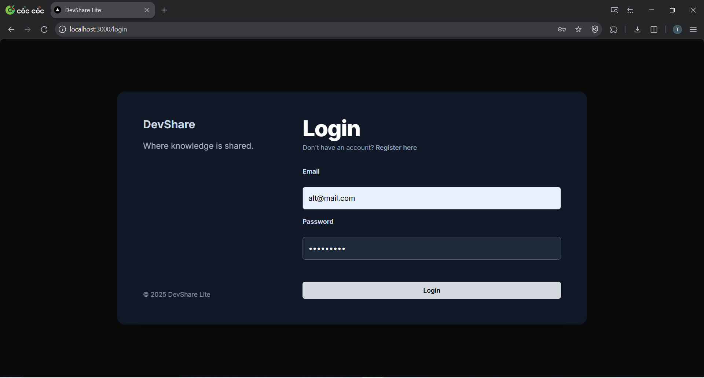
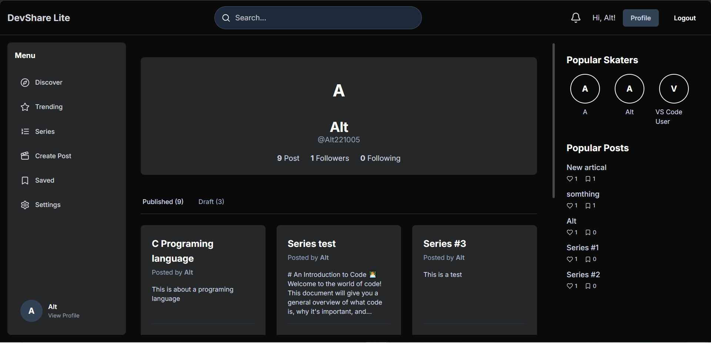
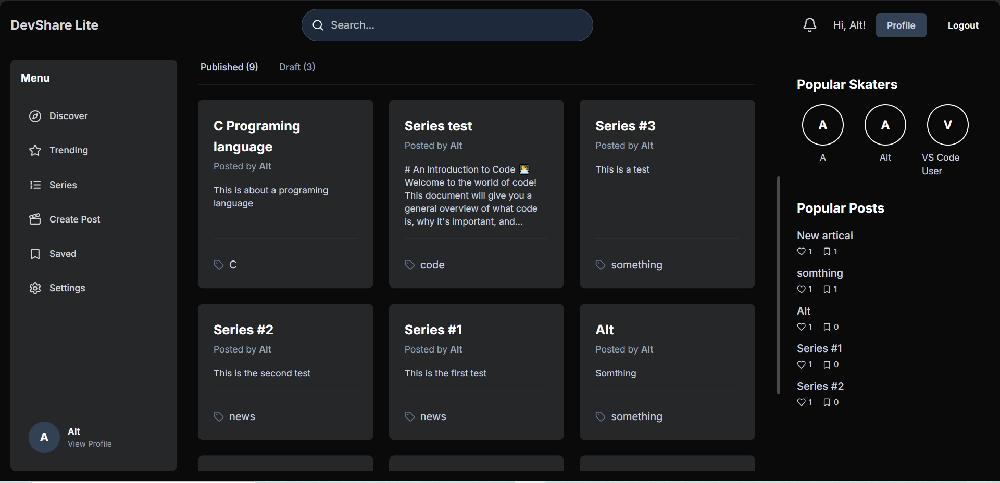

# Product Features - DevShare Lite

## 1. Main Features

DevShare Lite is a full-stack knowledge-sharing platform for the developer community. Below are the core implemented features.

### a. User Authentication

Users can securely create an account, log in, and log out.

* **Registration:** The registration form requires a name, username, email, and password. The backend validates the uniqueness and format of the information.
* **Login:** Users log in with their email and password. Upon success, a Laravel Sanctum authentication token and user data are securely stored on the client-side to maintain the session.
* **Logout:** Clears the token and user data from the client and invalidates the token on the server.

---

### b. Post Management (CRUD)

Users have full CRUD (Create, Read, Update, Delete) capabilities for their posts.

* **Create Post:** A writing interface with **Markdown** support allows users to format their content flexibly. Users can also assign tags and add the post to a series.
* **Read Post:** Displays the detailed content of a post, author information, related tags, and a comment section.
* **Update Post:** Users can edit the title, content, tags, and status (draft/published) of their existing posts.
* **Delete Post:** Allows for the permanent removal of a post from the system.
* **Discover:** The main feed shows the latest posts from the community.

---

### c. Comments Management

* **Comments:** A commenting system enables discussions beneath each post.
* **Nested Comments:** The comment system supports replying to other comments, creating structured and in-depth discussion threads.
* **Search:** Full-text search functionality for finding both posts and users by keywords.

### d. Basic Search

* **Search:** Full-text search functionality for finding both posts and users by keywords.

### e. User Profile

* **User Profiles:** Each user has a public profile page displaying their information, a list of published posts, and follower/following counts.
* **Drafts:** Users can save posts as drafts to finish later instead of publishing them immediately. These drafts are only visible on the owner's profile page.

---

## 2. Advanced Features Implemented

Beyond the basic requirements, the project includes the following advanced features:

* **Post Series:** Users can group related articles into an ordered series, making it easier for readers to follow a long-form topic.

* **Like and Save Posts:** Users can "Like" a post to show appreciation and "Save" (Bookmark) it for later reading.

* **Follow Users:** Allows users to follow other authors to get updates on their new content.

* **Notifications:** Users receive notifications (near real-time via polling) when another user follows them.

* **Trending Algorithm:**
    * **Trending Posts:** A ranking algorithm for trending posts based on a calculated score from likes, comments, and saves, combined with a time-decay factor. New and highly-interactive content is prioritized.
    * **Popular "Skaters" (Developers):** Similarly, the system identifies and suggests popular authors ("skaters") based on the cumulative trending score of their posts.

* **Update Profile:** Users can update name, username, even password 

---

## 3. Problems Encountered and Solutions

1.  **Problem:** Managing authentication state across a Single-Page Application (SPA) consistently and efficiently.
    * **Solution:** Implemented **React's Context API (`AuthContext.tsx`)** to create a Provider that wraps the entire application. This solution provides user information and tokens to any component that needs them without prop-drilling, leading to cleaner and more maintainable code.

2.  **Problem:** Handling asynchronous operations, loading states, and API errors smoothly and in a user-friendly manner.
    * **Solution:** Consistently applied `async/await` with `try...catch...finally` blocks in React components. Each component manages its own `loading` and `error` states, allowing for the display of "Loading..." messages while waiting for data and specific error messages on API failure, which improves the user experience.

3.  **Problem:** Creating a fair and dynamic "trending" algorithm that prioritizes new content while accurately reflecting community engagement.
    * **Solution:** Developed a custom scoring formula in `PostController.php`. The formula combines:
        * **Interaction Weighting:** Different weights are assigned to different actions (Comments > Saves > Likes).
        * **Time-Decay Factor:** An exponential decay function with a gravity constant (`$gravity = 1.8`) is used to decrease a post's score over time, ensuring new content has a chance to surface.

---

## 4. Known Limitations

* **Basic Markdown Editor:** The current post editor is a simple `<textarea>`, requiring users to manually type Markdown syntax without helper tools like a toolbar or a live preview.
* **No Admin Role/Panel:** The system lacks an administrator role and a dedicated dashboard for managing users, moderating content, or viewing site-wide analytics.
* **Simple Search:** The search functionality relies on basic SQL `LIKE` queries, which can be inefficient with large datasets and lacks advanced features like fuzzy search or complex result ranking.
* **Notification Polling:** Notifications are fetched by periodically sending requests to the server (polling) rather than using a real-time connection like WebSockets, which can cause delays and increase server load.

---

## 5. Future Directions

* **Upgrade Text Editor:** Integrate an advanced Markdown editor like **Editor.js** or **Tiptap** to provide a richer writing experience.
* **Build an Admin Dashboard:** Develop a separate administrative area for comprehensive platform management.
* **Implement Real-time with WebSockets:** Replace polling mechanisms with **Laravel Echo** and **Soketi/Pusher** for true real-time notifications and interactions.
* **Integrate a Dedicated Search Engine:** Use **Elasticsearch** or **Algolia** to build a more powerful and accurate search function.
* **Expand Test Coverage:** Write more comprehensive Unit and Feature tests for both the backend and frontend to ensure application stability and reliability.